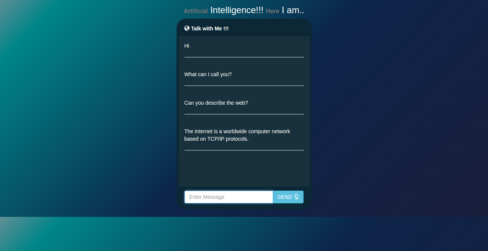

# ChatBot
AI bsed ChatBot

### Requirements
   Python = 2.x.x
 
   Flask
   
   Aiml
   
   pip

## Installation
Step 1) Open Command Prompt 

Step 2) Navigate to Project Directory

Step 3) Install Required packages by following Commands

       i) pip install -r requirements.txt
   
      ii) pip install python-aiml

Step 4) Run the Python Server
    
      i) python main.py

Step 5) Open **http://127.0.0.1:5000** in your browser.

Step 6) This will start you chatBot and you are good to go

# Images 

